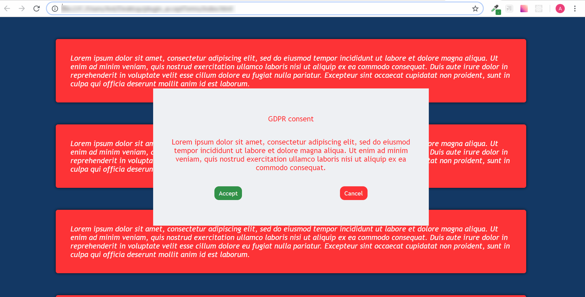

# Plugin with cookies box

> plugin responsible for downloading information from the user in relation to GDPR

## The plugin meets the following assumptions:

* Can be embedded anywhere on the page (head or body).
* Launches as soon as possible after being read by the browser.
* Displays the information box in the middle of the page. 
* While displaying, switches off page scrolling (so that it always is visible).
* The box contains two buttons: ```Accept``` and ```Cancel```.
* The box is 600px wide and 300px high.
* After clicking on ```Accept``` or ```Cancel```, the plugin saves the information in local storage whether the user has agreed or not 
* After the decision is saved, the box disappears and enables scrolling of the page.
* After refreshing the page, the plugin displays the information box again, prociding 24 hours have passed from the previous user's decision.

## Preview:

 
